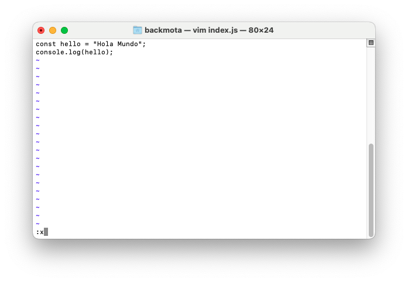

[`Programación con JavaScript`](../Readme.md) > `Módulo 1 - Clase 1`

## Tabla de Contenidos

- Introducción a JavaScript
- Añadiendo Script
- Herramientas para desarrolladores
- Fundamentos de la sintaxis
- Variables y tipos
- Interacción con el usuario
- Operadores principales
- Números
- Líneas
- Operadores lógicos

## Creando un archivo JS en la terminal o git bash 

1. Creando un archivo JavaScript utilizando la Terminal(Linux o Mac) o con GitBash.

Al abrir la terminal vamos a generar una carpeta donde vamos alojar nuestros archivos de JavaScript con el comnado 

```javascript
mkdir js
```

Ya que tenemos creado nuestra carpeta podemos acceder a ella por medio del comando *cd js* y una vez accedido a nuestro directorio vamos a crear un archivo .js con el comando 

```javascript
vim index.js
```

Para poder acceder al modo de escritura pulsaremos una unica ocasión la tecla *i* , en la parte inferior de la pantalla identificaremos que cambia a --INSERT-- y procederemos a escribir nuestra primera variables 

```javascript
const hello = "Hola Mundo";
console.log(hello);
```

Para guardar la información será necesario pulsar la tecla *esc* seguido por la tecla *:* y agregaremos una x, despues pulsaremos enter.


